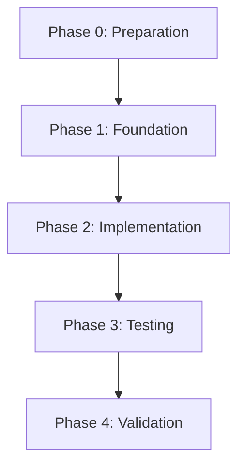

# Planner Skill

> **Type**: Strategic Skill
> **Exclusive**: Claude Code (Opus) only
> **Purpose**: Deep reasoning for task decomposition and planning

---

## Purpose

Analyze complex tasks and produce comprehensive, multi-phase implementation plans with:
- Task tier classification
- Dependency analysis
- Risk assessment
- Resource estimation
- Validation checkpoints

**Task Tier**: Tier 3 (Strategic) - Requires deep reasoning and judgment

---

## Scope

**Does**:
- Break down complex initiatives into phases
- Identify dependencies and critical paths
- Assess risks and propose mitigations
- Classify subtasks by tier
- Design validation strategy
- Consider edge cases and failure modes

**Does NOT**:
- Execute implementation (delegate to appropriate agent)
- Make trivial task breakdowns (use Codex for simple tasks)
- Write code (planning only)

---

## When to Use

Invoke this skill when:
- User requests planning for complex feature
- Task affects >5 files or multiple modules
- Public API changes required
- Unclear requirements need clarification
- Multiple implementation approaches exist
- High-risk changes (data migration, breaking changes)

**Quick Decision**:
- Tier 3 task → Use planner.skill.md
- Tier 2 task with clarity → Direct implementation
- Tier 0-1 task → Codex CLI

---

## Planning Dimensions

### Dimension 1: Scope Analysis

**Questions to Answer**:
- What modules are affected?
- What files will change?
- Are there public API changes?
- What external dependencies exist?

**Output**: Affected scope map

---

### Dimension 2: Dependency Analysis

**Questions to Answer**:
- What must happen first?
- What can happen in parallel?
- What are the blocking dependencies?
- What external systems are involved?

**Output**: Dependency graph with critical path

---

### Dimension 3: Risk Assessment

**Risk Categories**:
| Risk Type | Examples | Mitigation |
|-----------|----------|------------|
| **Breaking Change** | Public API modification | Deprecation strategy, versioning |
| **Data Loss** | Migration, schema change | Backup, rollback plan |
| **Performance** | Algorithm change, new queries | Profiling, benchmarking |
| **Security** | Auth changes, data exposure | Security review, penetration test |
| **Compatibility** | iOS version, dependency upgrade | Compatibility matrix, feature flags |

**Output**: Risk matrix with mitigations

---

### Dimension 4: Phase Decomposition

Break implementation into phases:

**Phase 0: Preparation**
- Constitutional review
- Architecture analysis
- Dependency audits
- Test infrastructure setup

**Phase 1: Foundation**
- Core abstractions (protocols, base classes)
- Data models
- Essential utilities

**Phase 2: Implementation**
- Feature logic
- Integration points
- Error handling

**Phase 3: Testing**
- Unit tests
- Integration tests
- Edge case coverage

**Phase 4: Validation**
- Manual testing
- Performance benchmarks
- Security audit

**Output**: Phased implementation plan

---

### Dimension 5: Task Tier Classification

For each subtask, determine tier:

**Tier 0 (Trivial)**: Mechanical changes
- Delegate to: Codex CLI
- Examples: Fix typo, add import

**Tier 1 (Standard)**: Pattern-based implementation
- Delegate to: Codex CLI or Cursor
- Examples: Add unit test, apply refactoring

**Tier 2 (Complex)**: Requires analysis
- Delegate to: Claude Code (Sonnet) or Cursor
- Examples: Bug fix, feature implementation

**Tier 3 (Strategic)**: Architectural decisions
- Handle by: Claude Code (Opus)
- Examples: API design, system architecture

**Output**: Task list with tier assignments

---

### Dimension 6: Validation Strategy

Define success criteria for each phase:

**Types of Validation**:
1. **Compilation**: Code compiles without errors
2. **Unit Tests**: All tests pass
3. **Integration Tests**: Round-trip tests succeed
4. **Performance**: Benchmarks meet targets
5. **Security**: No new vulnerabilities
6. **Constitutional**: Complies with all articles

**Output**: Validation checklist per phase

---

## Execution Steps

### Step 1: Context Gathering

1. **Read foundational documents**:
   ```bash
   cat constitution.md
   cat ARCHITECTURE.md
   cat AGENTS.md
   ```

2. **Identify affected areas**:
   ```bash
   # Find relevant files
   grep -r "keyword" Sources/

   # List module structure
   ls -R Sources/
   ```

3. **Analyze dependencies**:
   ```bash
   # Check imports
   grep -r "import" Sources/Module/

   # Check Podfile
   cat Podfile
   ```

### Step 2: Requirements Clarification

If requirements are ambiguous, use **AskUserQuestion** to clarify:
- Which approach to take?
- What are priority features?
- What are acceptable trade-offs?

**Don't proceed without clarity.**

---

### Step 3: Scope Analysis

Map out:
- Affected modules
- Changed files
- New files to create
- Public API impact

---

### Step 4: Risk Assessment

For each risk:
1. **Identify**: What could go wrong?
2. **Assess**: What's the impact and likelihood?
3. **Mitigate**: How to prevent or minimize?

---

### Step 5: Phase Decomposition

Break work into 3-5 phases with:
- Clear deliverable per phase
- Dependencies between phases
- Validation gate at end of each phase

---

### Step 6: Task Classification

For each task in each phase:
- Assign task tier (0-3)
- Identify appropriate agent/tool
- Estimate complexity

---

### Step 7: Validation Strategy

Define how to verify each phase:
- What tests to run?
- What metrics to check?
- What manual verification needed?

---

### Step 8: Output Plan

Generate comprehensive plan using output format below.

---

## Output Format

```markdown
# Implementation Plan: [Feature Name]

---
task_tier: 3
model: opus-4-5
agent: claude-code
timestamp: [ISO8601]
---

## Executive Summary

**Goal**: [One sentence goal]
**Complexity**: [Tier 3 - Strategic]
**Estimated Scope**: [X modules, Y files, Z new files]
**Risk Level**: [Low/Medium/High]
**Constitutional Impact**: [Articles affected]

---

## Scope Analysis

### Affected Modules
| Module | Changes | Public API Impact |
|--------|---------|-------------------|
| MSPCore | Add caching layer | No |
| MSPiOSSDK | Expose cache config | Yes - new property |

### Files to Modify
- `Sources/Core/MSPCore/BidLoader.swift` (add cache integration)
- `Sources/SDK/MSPiOSSDK/AdConfiguration.swift` (add cache config)

### Files to Create
- `Sources/Core/MSPCore/Cache/AdCache.swift`
- `Tests/MSPCoreTests/Cache/AdCacheSpec.swift`

---

## Dependency Analysis



**Critical Path**: Preparation → Foundation → Implementation
**Parallelizable**: Testing can start during Implementation

---

## Risk Assessment

| Risk | Impact | Likelihood | Mitigation |
|------|--------|-----------|------------|
| Breaking API change | High | Medium | Use deprecation, add new API alongside |
| Cache memory pressure | Medium | Low | LRU eviction, configurable max size |
| Thread safety issues | High | Medium | Use NSCache (thread-safe), add tests |

---

## Implementation Phases

### Phase 0: Preparation (Tier 3 - Claude/Opus)

**Deliverable**: Architecture design document

**Tasks**:
1. [ ] Review ARCHITECTURE.md for current caching patterns
2. [ ] Check constitutional requirements (Article III.1)
3. [ ] Design `AdCacheProtocol` interface
4. [ ] Plan public API changes

**Validation**: Design reviewed and approved

**Handoff to**: Phase 1

---

### Phase 1: Foundation (Tier 2 - Claude/Sonnet or Cursor)

**Deliverable**: Core cache infrastructure

**Tasks**:
1. [ ] Create `AdCacheProtocol` (Tier 2)
2. [ ] Implement `AdCache` using NSCache (Tier 2)
3. [ ] Add cache configuration to `AdConfiguration` (Tier 1)

**Validation**:
- [ ] Code compiles
- [ ] No constitutional violations
- [ ] Cache protocol follows existing patterns

**Handoff to**: Phase 2

---

### Phase 2: Implementation (Tier 1-2 - Codex or Cursor)

**Deliverable**: Integrated caching

**Tasks**:
1. [ ] Integrate cache into `BidLoader.loadBid()` (Tier 2)
2. [ ] Add cache key generation logic (Tier 1)
3. [ ] Handle cache hits/misses (Tier 1)
4. [ ] Add logging for cache operations (Tier 1)

**Validation**:
- [ ] All compilation passes
- [ ] No force unwraps added
- [ ] Error handling in place

**Handoff to**: Phase 3

---

### Phase 3: Testing (Tier 1 - Codex)

**Deliverable**: Comprehensive test coverage

**Tasks**:
1. [ ] Unit tests for `AdCache` (Tier 1 - use unit-test-generator.skill.md)
2. [ ] Integration tests for cache in `BidLoader` (Tier 1)
3. [ ] Thread safety tests (Tier 2)
4. [ ] Performance benchmarks (Tier 2)

**Validation**:
- [ ] All tests pass
- [ ] Code coverage >80%
- [ ] Performance meets targets

**Handoff to**: Phase 4

---

### Phase 4: Validation (Tier 2-3)

**Deliverable**: Production-ready feature

**Tasks**:
1. [ ] Manual testing in demo app (Tier 1)
2. [ ] Constitutional audit (Tier 1 - use constitutional-auditor.skill.md)
3. [ ] Performance profiling (Tier 2)
4. [ ] Security review (Tier 3)

**Validation**:
- [ ] Demo app works correctly
- [ ] No constitutional violations
- [ ] Performance acceptable
- [ ] No security issues

**Completion Criteria**: All phases validated, ready to commit

---

## Task List with Agents

| Task | Tier | Agent | Model |
|------|------|-------|-------|
| Design cache architecture | 3 | Claude Code | Opus |
| Create AdCacheProtocol | 2 | Claude Code or Cursor | Sonnet |
| Implement AdCache | 2 | Claude Code or Cursor | Sonnet |
| Add configuration | 1 | Codex or Cursor | Sonnet 3.5 |
| Integrate into BidLoader | 2 | Claude Code or Cursor | Sonnet |
| Generate unit tests | 1 | Codex | Haiku |
| Run constitutional audit | 1 | Codex | Haiku |
| Manual validation | 1 | Human | N/A |

---

## Validation Strategy

### Per-Phase Gates

**Phase 0**: Design approved by human
**Phase 1**: Code compiles, constitutional check passes
**Phase 2**: Integration tests pass
**Phase 3**: Unit tests pass, coverage met
**Phase 4**: Manual testing complete, all audits pass

### Final Validation Checklist

- [ ] All code compiles
- [ ] All tests pass
- [ ] Constitutional audit clean
- [ ] Performance benchmarks met
- [ ] Security review complete
- [ ] Documentation updated
- [ ] Demo app tested

---

## Rollback Strategy

If critical issue found:
1. Identify failing phase
2. Rollback to previous phase checkpoint
3. Re-analyze and adjust plan
4. Resume from fixed point

---

## Cost Estimate

**Model Usage**:
- Opus (Phase 0): ~50K tokens ($5)
- Sonnet 4 (Phase 1-2): ~200K tokens ($8)
- Sonnet 3.5 (Phase 2-3): ~100K tokens ($2)
- Haiku (Phase 3): ~50K tokens ($0.15)

**Total Estimated Cost**: ~$15.15

**Time Estimate**: 2-4 hours (depends on complexity discovered during implementation)

---

## Next Steps

1. **Approve this plan**: Review and confirm approach
2. **Execute Phase 0**: Begin with architecture design
3. **Checkpoint after each phase**: Validate before proceeding

**Ready to proceed?**
```

---

## Example Usage

### For Strategic Planning

```bash
$ claude
> I need to add OAuth authentication to the SDK. Plan the implementation.

[Planner skill activated]
[Analyzes scope, assesses risks, breaks into phases]
[Produces comprehensive plan]
```

---

## Tips for Effective Planning

1. **Clarify First**: Don't plan without understanding requirements
2. **Think Holistically**: Consider all dimensions (scope, risk, dependencies)
3. **Be Realistic**: Estimate conservatively
4. **Plan for Failure**: Include rollback and mitigation strategies
5. **Validate Often**: Gate between phases prevents late-stage issues

---

## Related Skills

- `architect.skill.md`: For detailed API and module design
- `constitutional-auditor.skill.md`: For compliance verification
- `sources-bug-analyst.skill.md`: If planning bug fix
- `scripts-failure-analyst.skill.md`: If planning automation fix
