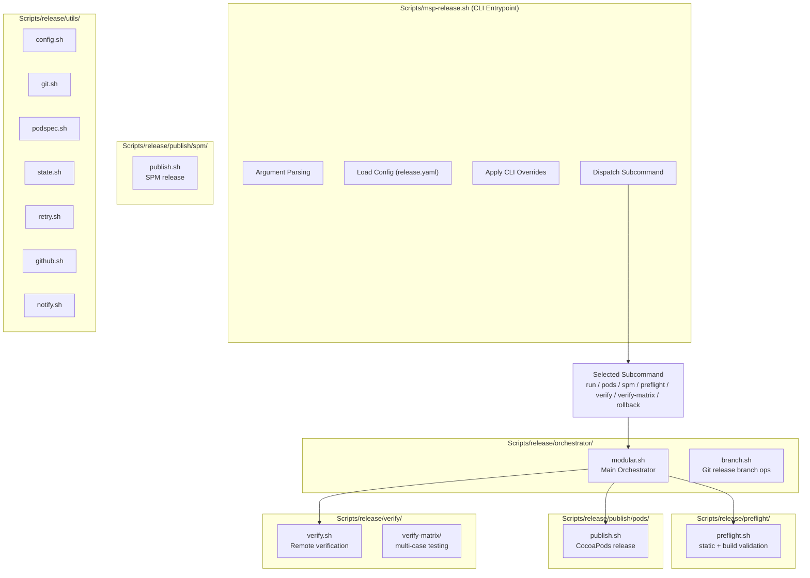

# MSP iOS SDK Release System - Architecture Freeze

**Status:** FROZEN (as of Phase 3 completion)  
**Date:** 2025-11-28  
**Policy:** NO STRUCTURAL CHANGES ALLOWED

---

## 🚫 FROZEN DIRECTORY STRUCTURE

The following directory structure is **FINAL** and **MUST NOT** be modified:

```
Scripts/
├── msp-release.sh                      # Top-level CLI entrypoint (MUST remain here)
└── release/
    ├── orchestrator/                   # High-level orchestrator layer
    │   ├── modular.sh                  # Main pipeline controller
    │   └── branch.sh                   # Release branch logic
    ├── preflight/                      # Static + build validations
    │   └── preflight.sh
    ├── publish/
    │   ├── pods/
    │   │   └── publish.sh              # CocoaPods release pipeline
    │   └── spm/
    │       └── publish.sh              # SPM release pipeline
    ├── verify/
    │   └── verify.sh                   # Remote verification (Pods + SPM)
    ├── verify-matrix/                  # 15-case automated matrix testing
    │   ├── matrix.sh
    │   ├── generate_cases.sh
    │   └── cases/*.sh
    └── utils/                          # Stateless shared modules
        ├── config.sh
        ├── git.sh
        ├── github.sh
        ├── notify.sh
        ├── podspec.sh
        ├── retry.sh
        ├── state.sh
        └── version.sh
```

---

## 📐 ARCHITECTURE DIAGRAM



---

## 🔒 FROZEN POLICY (MANDATORY)

1. **DO NOT** move any file to a different directory.
2. **DO NOT** rename folders.
3. **DO NOT** collapse layers (e.g., no merging publish/ and orchestrator/).
4. **DO NOT** introduce new top-level Scripts/ subfolders.
5. All new scripts **MUST** be placed inside existing folders according to rules:
   - Pods publishing logic → `publish/pods/`
   - SPM publishing logic → `publish/spm/`
   - New validations → `preflight/` or `verify/`
   - Matrix-related logic → `verify-matrix/`
   - Low-level helpers → `utils/`
6. `msp-release.sh` **MUST** remain the only top-level entrypoint.
7. All scripts **MUST** load UI/logging via `release-common.sh` or existing pattern.
8. Architecture diagrams above **MUST** remain correct and in sync permanently.

---

## 🎯 PURPOSE OF THIS FREEZE

- The release system is now fully architected (Phase 1 → Phase 3).
- All refactors are complete.
- All cross-dependencies and layers are stable.
- Orchestration + Preflight + Publish + Verify + Matrix form a total cycle.
- Future changes **MUST** be internal logic only, not structural.

The system is now in a **"production architecture"** state.

**No further reorganization is allowed.**

---

## ✅ VERIFICATION

To verify the structure matches this freeze:

```bash
# Check directory structure
find Scripts/release -type d | sort

# Check all scripts are in correct locations
find Scripts/release -type f -name "*.sh" | sort

# Verify msp-release.sh is at top level
ls -la Scripts/msp-release.sh
```

---

## 📝 CHANGE LOG

- **2025-11-28**: Architecture freeze established after Phase 3 completion
- All directory structure changes are now prohibited
- Only internal logic modifications are permitted

